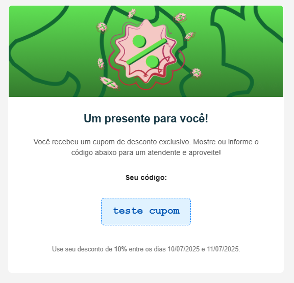

# Projetos

Esse repositório tem vários projetos separados em pastas, cada um com seu próprio README e instruções relevantes.

| Projeto         | Descrição                |
|-----------------|-------------------------|
| [aws_lambda](./aws_lambda)         | Infraestrutura e deploy automático de uma função lambda que executa periodicamente                        |
| [python_email_server](./email_server/py-server/)           | CRUD de usuário, envio estratégico de emails e arquitetura hexagonal que se comunica com 2 bancos de dados                        |
| [typescript_email_server](./email_server/ts-server/)           | Envio de emails simples (protótipo)                        |
| [register_user_screens](./register_user_screens)           | App Flutter para Web, Desktop e Android                        |
| [users_table_processing_pipeline](./users_table_processing_pipeline)     | Limpeza e utilização de dados de tabelas com usuários                        |

# Exemplo de email

