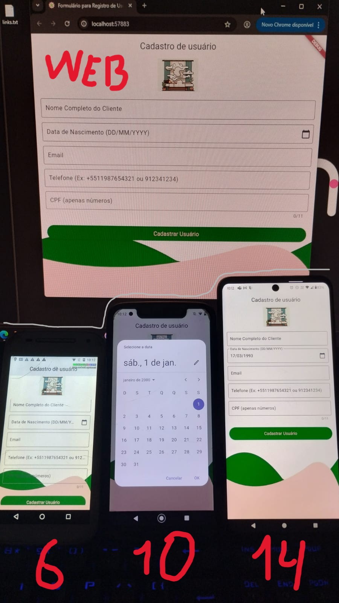
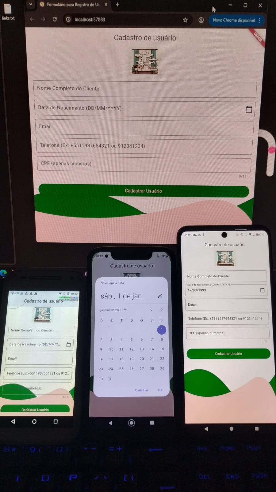

# Build

```bash
cd register_user_screens/
flutter config --enable-web
flutter create .

flutter build windows --release
flutter build apk --release # Android
flutter build web --release

flutter build appbundle --release # Play Store
```

# Instalar em um dispositivo conectado ao PC de desenvolvimento

Troque `<seu_usuario>` pelo usuário real.

```bash
flutter install --use-application-binary="C:\Users\<seu_usuario>\Desktop\mini-CRM\register_user_screens\build\ap
p\outputs\flutter-apk\app-release.apk"
```


<!--  -->
